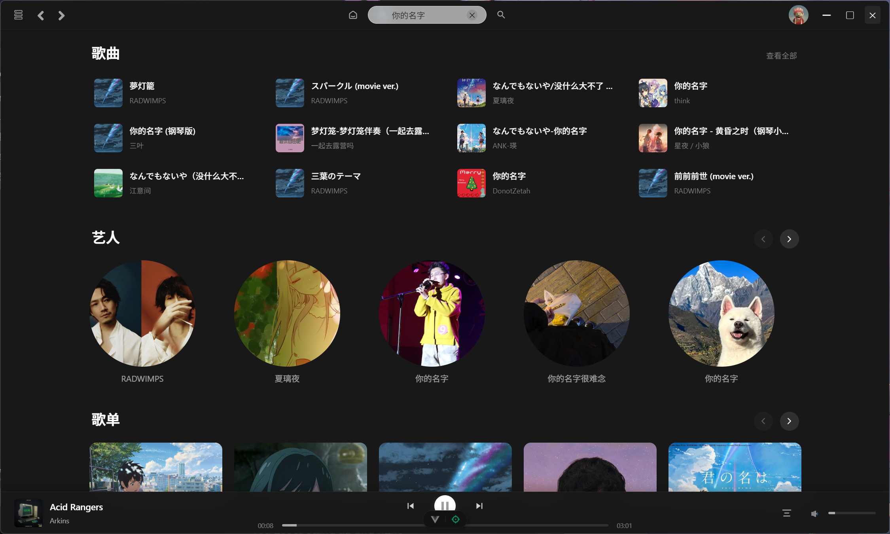

# **PoloMusic**

基于vue3 + Electron的音乐播放器，数据由第三方网易云api获取。（技术有限，在一些性能优化、代码规范上做得不是很好，这在后续会进行规范化。对于打包后体积过大问题暂时不解决，这个只作为一个小玩具。）

## 使用

------

拉取文件到本地
将[第三方网易云api](https://github.com/NeteaseCloudMusicApiEnhanced/api-enhanced)文件夹放到polomusic中，

分别在polomusic和net目录下执行`npm install`

vue服务默认端口 5173
net api服务默认端口 3000
可通过`npm run electron:dev`启动三个服务

也可以将net api[部署](https://github.com/NeteaseCloudMusicApiEnhanced/api-enhanced)在服务器减轻本地占用

## 功能

------

- 支持网易账号登录（手机 / 邮箱 / 扫码 / cookie） ps: 手机、邮箱和扫码登录目前由于api限制无法完美支持,扫码登录比较慢(测试成功登录需要近两分钟)。
- 支持显示类AppleMusic歌词页面
- 支持逐字歌词
- 支持每日推荐歌单、私人FM  ps: 私人FM可能存在瑕疵。
- 支持音乐解灰(感谢[第三方网易云api](https://github.com/NeteaseCloudMusicApiEnhanced/api-enhanced)提供的接口以及[unblockneteasemusic](https://github.com/UnblockNeteaseMusic/server)提供的解灰服务）
- 支持无vip播放时替换原试听链接为其他平台(由[解灰服务](https://github.com/UnblockNeteaseMusic/server)为基础)
- 支持最新音乐推荐
- 支持推荐歌单
- 支持精选歌单
- 支持关闭应用保存上次播放信息（进度、播放列表）
- ...更多功能还在开发中
  
## 待完善功能

------

1. 完善个人页面（最近播放、我喜欢的歌单、收藏歌单等）
2. 喜欢歌曲
   
## 灵感来源

------

[网易云音乐](https://music.163.com/)

[yesplaymusic](https://github.com/qier222/YesPlayMusic)

## 开发说明
修改、二次分发请注明出处